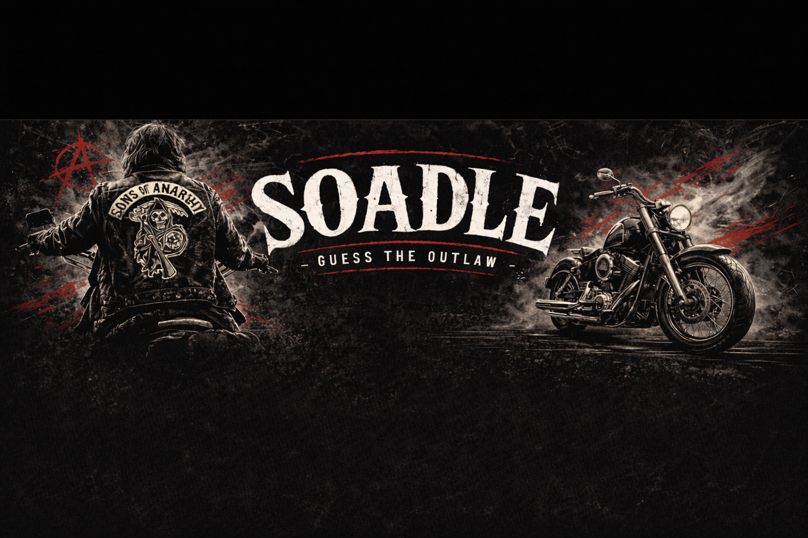

README corrigé

  

<h1 align="center">SOADLE</h1>

  Jeu de devinette inspiré du genre dle, centré sur l’univers de Sons of Anarchy.

---

## 🧠 Présentation

**SOADLE** est un jeu de devinette dans lequel le joueur doit identifier des personnages issus de l’univers *Sons of Anarchy*.

Le projet est conçu pour être :

- rapide
- simple
- maintenable
- sans dépendances inutiles

---

## ⚙️ Stack technique

- PHP 8.x (sans framework)
- SQLite (par défaut) / MySQL (optionnel)
- rendu HTML côté serveur (SSR)
- JavaScript minimal

---

## 🧱 Architecture

Le projet repose sur une architecture volontairement simple :

- pas de framework
- pas d’ORM
- SQL direct (PDO)
- abstractions minimales
- rendu côté serveur prioritaire

Séparation des couches :

- Domain/ → logique métier
- Application/ → cas d’usage
- Infrastructure/ → accès DB
- Http/ → contrôleurs et routing

Documentation associée :

- docs/conventions/ → standards de développement
- docs/adr/ → décisions d’architecture

---

## 📁 Structure du projet

app/
  Domain/
  Application/
  Infrastructure/
  Http/

bootstrap/
public/
resources/
database/
  migrations/
scripts/
tests/
docs/

---

## 🚀 Démarrage rapide

### 1. Lancer le serveur

    php -S localhost:8000 -t public

### 2. Vérifier l’application

    http://localhost:8000/health

---

## 🗄️ Base de données

### Configuration

Par défaut, le projet utilise SQLite local :

    DB_DSN=sqlite:var/database/app.sqlite
    DB_USER=
    DB_PASSWORD=

---

### Lancer les migrations

    php scripts/migrate.php

---

### Réinitialiser la base

    php scripts/reset-db.php

---

## 🩺 Health check

Endpoint :

    GET /health

Retour :

    {
      "status": "ok",
      "checks": {
        "app": "ok",
        "db": "ok"
      }
    }

Objectif :

- vérifier que l’application démarre
- vérifier la connexion base de données
- servir de test rapide pour le workflow Git

---

## 🔍 Qualité & sécurité

### Vérification avant push

Un hook Git exécute automatiquement :

- lint PHP
- boot HTTP
- health check

---

### Sécurité

Le projet utilise Snyk pour détecter les vulnérabilités dans les dépendances.

---

## 🔁 Workflow Git

main        → stable, déployable  
develop     → intégration  
feature/*   → développement  

Règle :

> Toute branche doit passer /health avant merge.

---

## 📌 Principes de développement

- KISS
- YAGNI
- SOLID pragmatique
- performance by design
- lisibilité avant abstraction

---

## 👤 Auteur

**Malky Dev**

---

## ⚖️ Disclaimer

Projet personnel non officiel.

Ce projet n’est ni approuvé, ni affilié, ni sponsorisé par les ayants droit de Sons of Anarchy.

Respect et remerciements à Kurt Sutter pour la création de cet univers.